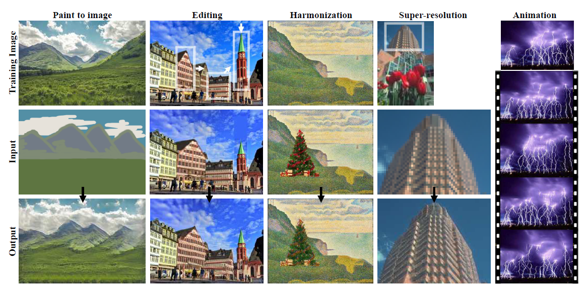
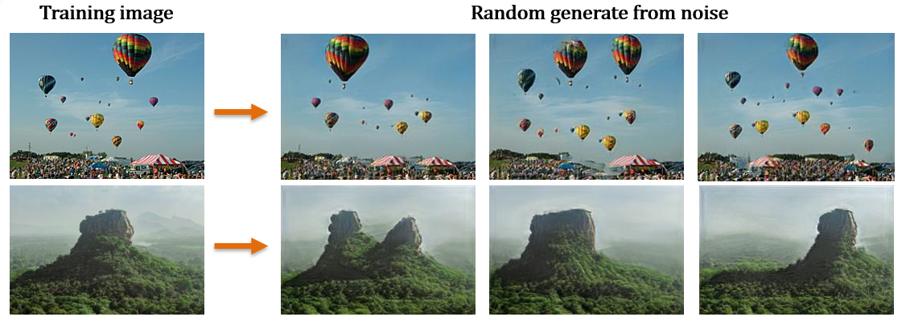

# SinGAN

This is an implementation of [SinGAN](https://arxiv.org/abs/1905.01164) on Python 3 and Tensorflow 2. 

SinGAN is an unconditional generative model that can be learned from a single natural image, and is then able to generate diverse realistic image samples with new object shapes and structures while preserving the original image distribution, making it very useful in various image manipulation tasks.

## Image Applications
SinGAN can be used for the following manipulation tasks without any network changes or further tuning.

## Implementation Details
- The **multi-scale network** is roughly based on the SinGAN paper,  with zero-pad the inputs to the generator(both image and noise) instead of padding in each layer, increasing the variability at corners, and replace batch normalization with [instance normalization](https://arxiv.org/abs/1607.08022), since instance-norm is more suitable for generative model.
- The **WGAN-GP** objective function is a bit different from the "regular" [WGAN-GP](https://arxiv.org/abs/1704.00028) which trained on a dataset of images, the intention is to maintain 1-lipschitz condition in a patch manner, as the output of discriminator is a map of score per patch, therefore, the gradient norms are computed by `slopes = tf.sqrt(tf.reduce_sum(tf.square(gradients), axis=[3]))`. 

### Training SinGAN
Use `main.py` to train a new SinGAN model.

The **training configuration** follows [supplementary material](), and all the examples of this repository are generated from the same network with 8 scales. The training takes 40~50 minutes on a GTX 1060 3GB .

Example usage:

    python main.py train --image ./path/to/image.jpg --num_scales 8

The number of scales in SinGAN's architecture strongly influences the results.

### Random Sampling
Use `main.py` to generate new image. 
Evaluation takes < 1s per frame(250x188) on a GTX 1060 3GB.

Example usage:

    python main.py inference --image ./path/to/inference_image.jpg  --dir ./weights_dir  --mode random_sample  --inject_scale 0

**Results :**

      
      
### Harmonization / Editing / Paint2Image
Use `main.py` to manipulate image. 
Evaluation takes < 1s per frame(250x188) on a GTX 1060 3GB.

Example usage:

    python main.py inference --image ./path/to/inference_image.jpg  --dir ./weights_dir  --mode editing  --inject_scale 1

**Results of Editing and Harmonization :**

    
**Results of Paint to image :**

### Requirements
You will need the following to run the above:
- TensorFlow >= 2.0
- Python 3, Pillow 7.0.0, Numpy 1.18

### Attributions/Thanks
- Some readme/docs formatting was borrowed from Tamar Rott Shaham's [SinGAN](https://github.com/tamarott/SinGAN)
- The stunning image of the Sigiriya Rock was taken by [Brian Kyed](https://unsplash.com/photos/8NpelZe-EzM)
